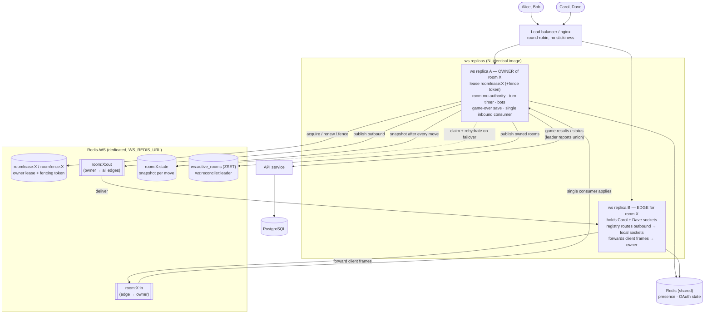

# Architecture

Seven Spade is a monorepo with three independently deployable services wired together via Docker Compose, plus a web SPA. External native clients can use the same HTTP API and WebSocket contracts.

## System Overview

```
Browser (React + TypeScript)
        ├── HTTP  ──► services/api   (Go)  ──► PostgreSQL 16
        │                                 └──► Redis 7  (OAuth state / PKCE)
        └── WS    ──► services/ws    (Go)  ──► Redis 7  (live room snapshots)
                          │
                          └── HTTP (internal) ──► services/api
```

The WS server persists live room state to Redis and calls the API's internal
endpoints (room status, member removal, orphan-room reconcile); the API
persists everything durable to PostgreSQL. Clients speak the same HTTP/JSON and
WebSocket protocols.

| Layer | Service | Tech | Port |
|---|---|---|---|
| Web frontend | `web/` | React + TypeScript + Vite + Tailwind CSS v4 | 3000 |
| HTTP API | `services/api` | Go (Gin) | 8080 |
| WebSocket game server | `services/ws` | Go (gorilla/websocket) | 8081 |
| Relational store | — | PostgreSQL 16 | 5432 |
| OAuth state + live room snapshots | — | Redis 7 | 6379 |

---

## Services

### HTTP API (`services/api`)

Handles all non-real-time operations:

- User authentication (guest, email/password, Google, GitHub, Telegram OAuth)
- Room creation and lobby management
- Game history persistence and retrieval
- Issues JWTs shared by both services

The API executable lives at `services/api/cmd/api`. Internal packages are layered under `services/api/internal/` (`config`, `database`, `cache`, `auth`, `repository`, `middleware`, `handler`, `server`). PostgreSQL migrations are embedded from `services/api/internal/database/migrations/` and applied on startup.

### WebSocket Game Server (`services/ws`)

Handles everything that requires low-latency, push-based communication:

- Authenticates WebSocket connections via JWT
- Manages per-room hubs through two phases: **lobby** (ready-up, host start,
  bot backfill) and **playing** (turn-based card play, rematch voting)
- Runs the **Game Engine** (pure Go package, `game/`) to validate and apply moves
- Persists each room as a **snapshot in Redis** (`store/`) so rooms survive a
  process restart; rooms are rehydrated lazily on the next (re)connect
- Enforces turn order, the turn timer, and the auto-play bot
- Calls the API's internal HTTP endpoints to persist game results, update room
  status, and reconcile orphaned rooms

The WS executable is the flat `main` package at `services/ws/`. The engine and
bot live in `services/ws/game/`; the Redis snapshot store in `services/ws/store/`.
Redis is **required** by the WS service — startup fails fast if it is
unreachable.

### Frontend (`web/`)

- Single-page React app (React 19, react-router v7) served via Nginx in production
- Uses Tailwind CSS v4 as the primary styling system
- Follows `design/design_system.html` for Seven Spade color, typography, card, board, lobby, and motion tokens
- Communicates with the API over HTTP/JSON and with the WS server over WebSocket
- Auth state lives in a shared `AuthProvider` context; the access JWT is kept in
  `sessionStorage` (survives same-tab refresh), while the refresh token is an
  HttpOnly cookie owned by the API

## Data Flow — Gameplay

```
Client                    WS Server (authoritative room state)        Redis
  │                          │                                          │
  │── play_card ────────────►│                                          │
  │                          │ ApplyMove() / ApplyAceClose() [engine]    │
  │                          │ update in-memory room state               │
  │                          │── SaveRoom(snapshot) (async) ────────────►│
  │◄── state_update ─────────│ (broadcast to all connected players)      │
  │                          │                                           │
  │                          │ on game over:                             │
  │                          │── POST /internal/games ───────► API ─► PostgreSQL
  │                          │── POST /internal/rooms/:id/status ► API
```

The WS server keeps each room's authoritative state in memory and writes a
durable **snapshot to Redis** after every change (asynchronously, off the room
lock). On a restart the in-memory map is empty; the first time a player
(re)connects to a room, the server loads its snapshot from Redis and rebuilds
the room. Durable game records (room status, completed games) are still written
through the API's internal endpoints.

---

## Horizontal Scaling — Multi-Replica WebSocket (owner + relay)

The WS service runs as **N identical replicas** behind a plain round-robin load
balancer (no sticky sessions). Because room state is authoritative and lives in
one process, the replicas coordinate through a **dedicated WS Redis**
(`WS_REDIS_URL`) using an **owner + pub/sub relay** model:

- **Owner replica** — exactly one per room, elected via a Redis lease
  (`roomlease:{id}` `SET NX PX`, heartbeat-renewed). The owner runs *all*
  authority: move application under `room.mu`, the turn timer, bot auto-play, and
  the game-over result save. It publishes per-recipient **outbound envelopes** to
  `room:{id}:out`.
- **Edge replica** — any replica that merely holds a player's socket. It runs no
  game logic: it forwards client frames to the owner on `room:{id}:in` and writes
  owner-published envelopes to its matching local sockets (selector-routed by a
  per-replica connection registry).
- **Fencing** — `roomfence:{id}` (`INCR` on each acquisition) gives every owner a
  monotonic token. A demoted owner (lost lease) stops applying, persisting, and
  publishing, so two replicas can never both drive a room.
- **Checkpoint failover** — the owner already snapshots the room to Redis after
  every move. If the owner dies, its lease lapses; the next replica a player
  connects to claims the lease, **rehydrates from the snapshot**, re-arms the
  turn timer, and resumes. Sockets on surviving edge replicas are not forced to
  reconnect.
- **Cluster reconciler** — owners publish their owned room ids to a TTL-scored
  shared set (`ws:active_rooms`); a single **leader-elected** replica
  (`ws:reconciler:leader`) reports the union to the API, so orphan-room cleanup
  runs once cluster-wide instead of once per replica.

Single-replica deployments are unchanged: with no relay configured, the owner
path is always taken and every send writes the local socket directly.



**Message flow for one move** (when the acting player is on an edge replica):

```
Carol's client ─play_card─► edge B ─publish room:X:in─► owner A
owner A: apply under room.mu → snapshot → render per-seat views
owner A ─publish room:X:out─► (edge B delivers to Carol+Dave) + writes Alice+Bob locally
```

See [deployment/scaling.md](./deployment/scaling.md#horizontal-ws-scaling-owner--relay-model)
for the Compose/Swarm setup and `WS_REDIS_URL`, and issue #63 for the full
design + acceptance criteria.

---

## Game Engine

The Game Engine is a **pure Go package** (`services/ws/game/`) with no I/O
dependencies. It encodes the complete Seven Spade rule set:

| Function | Description |
|---|---|
| `Deal(seed int64)` | Deterministic shuffle and deal; returns which player holds 7♠ |
| `ValidMoves(state, hand)` | Returns legal sequence plays plus any closable-Ace options for the current player |
| `AceCloseOptions(state, hand)` | Returns which suits the player can close with an Ace, and which ends (low/high) are legal |
| `ApplyMove(state, playerIndex, card, faceDown bool)` | Validates and applies a sequence play or face-down placement (Aces are rejected here) |
| `ApplyAceClose(state, playerIndex, suit, method)` | Closes a suit with an Ace and locks the global closing method |
| `IsGameOver(state)` | Returns true when all hands are empty |
| `CalculateScores(state)` | Sums face-down card values per player |

Aces never extend a sequence — they are only ever used to close a suit, so the
high end of a suit's range cannot be corrupted by a stray Ace.

---

## State Storage

### PostgreSQL

Stores durable data:

| Table | Contents |
|---|---|
| `users` | Registered accounts (nullable email, hashed password, display name) |
| `user_providers` | OAuth/OIDC provider identities linked to users |
| `rooms` | Room metadata (visibility, turn timer, status, invite code) |
| `room_players` | Lobby/room membership rows (room, user, display name) |
| `games` | Completed game records (room, start/end times) |
| `game_players` | Per-player results (penalty points, rank, winner flag) |

### Redis

Used by two services:

- **API** — transient OAuth state: `{state → PKCE code_verifier}` entries
  (10-minute TTL) during the OAuth/OIDC authorization flow.
- **WS** — live **room snapshots**: a JSON-encoded `RoomSnapshot` (game state +
  roster + phase/timers/rematch votes) under `room:<id>:state`, written after
  every change with a refreshed TTL (default 1h). This is what lets a room
  survive a WS restart. The WS service requires Redis and fails fast at startup
  if it is unreachable.

Both services also TCP-ping Redis in their `/health` dependency checks.

A rehydrated room restores all players as **disconnected** (a fresh process has
no live sockets); each reconnecting client re-attaches to its seat via the
normal join flow, and an in-progress game's turn timer resumes so auto-play
keeps it moving even before anyone returns.

---

## Inter-Service (Internal) API

The WS server reaches back into the API over HTTP for durable side effects.
These endpoints live under `/internal/*` on the API and are intended for the
docker-internal network. When `INTERNAL_API_SECRET` is set on both services,
the WS sends it as an `X-Internal-Secret` header and the API rejects calls that
don't match (the guard is disabled when the secret is empty).

| Endpoint | Purpose |
|---|---|
| `POST /internal/games` | Persist a completed game + per-player results |
| `POST /internal/rooms/:id/status` | Move a room `waiting → in_progress → finished` |
| `DELETE /internal/rooms/:id/players/:userId` | Drop a membership row when a player leaves the lobby |
| `POST /internal/rooms/reconcile` | Receive the WS server's live room-ID set and delete presence-less `waiting` rooms |

**Orphan-room reconcile:** the WS server periodically (~60s) reports the set of
room IDs it is tracking in memory. The API deletes any `waiting` room that is
both absent from that set and older than a short TTL (2 min), so abandoned
lobbies — a DB membership row whose player never connected over WebSocket — stop
lingering in the public lobby list. The TTL protects the brief window between a
room being created and its host's socket connecting.

> **Restart interaction:** after a WS restart the in-memory room map is empty
> until players reconnect (rooms rehydrate lazily on join). A `waiting` room
> nobody rejoins within the API's 2-minute TTL is still reaped, and its Redis
> snapshot eventually expires. In-progress/finished rooms aren't in the public
> list, so they persist in Redis until joined or TTL-expired.

---

## Authentication

Both services share the same `JWT_SECRET`. The JWT payload:

| Claim | Description |
|---|---|
| `sub` | User UUID (random for guests) |
| `display_name` | Player's display name |
| `is_guest` | `true` for guest sessions |
| `exp` | Expiry timestamp |

The frontend stores the app access JWT in `sessionStorage` / React state. The refresh token is stored only as an `HttpOnly; SameSite=Strict` cookie and is rotated by `POST /refresh`.

Native clients without a browser cookie jar can carry the refresh token
explicitly: `POST /refresh` and `DELETE /auth/logout` accept a
`{ "refresh_token": "..." }` body, and `/register`, `/login`, `/refresh`, and
the OAuth callback echo a rotated `refresh_token` in the response body for that
flow. OAuth additionally accepts a `redirect_uri` query param on
`GET /auth/:provider/url` (and the matching callback), restricted to the
`sevenspade://`/`exp://` deep-link schemes, so the provider redirect can return
to an external native app.

The WS server validates the JWT on the initial WebSocket upgrade request; unauthenticated connections are rejected immediately.

### Self-profile + editable display name

The web client exposes a "My profile" screen (`/me`) showing the logged-in
user's avatar, display name, lifetime stats, and achievements. Guests get a
limited view (name + a register prompt) since they have no DB row and are blocked
from `/stats`, `/history`, and `/friends`. Public profiles for *other* players
remain at `/players/:id`.

Registered users can edit their display name via `PATCH /me`. Because the name
is embedded in the JWT (read by the WS server to label the seat) **and** stored
in `users.display_name` (used by stats/leaderboard/history/friends), the handler
updates the row and **re-issues the access JWT**; the client swaps the new token
into its session so future API calls and games reflect the change. The refresh
token is left untouched (the name isn't stored in it). A rename does not relabel
the seat in an in-progress WS game — that's captured at connection time — so it
applies to the next connection.
