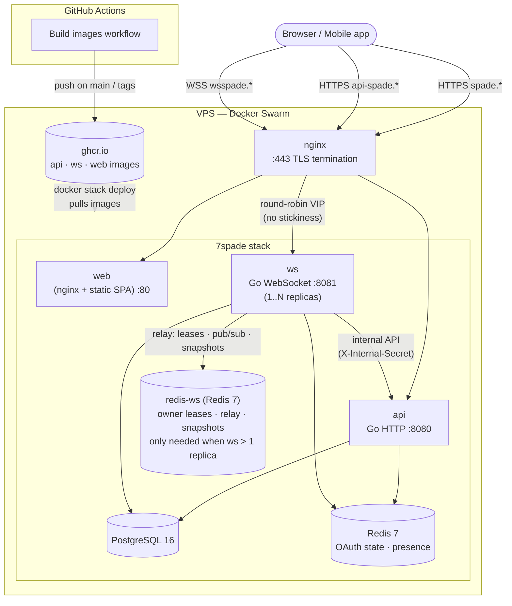

# Deployment Guide

This guide covers deploying Seven Spade to production on a single VPS using Docker Swarm (`docker stack deploy`) behind an nginx reverse proxy with TLS.

> **Images are built in CI, never on the server.** The [Build images](../.github/workflows/build-images.yml) GitHub Action builds the `api`, `ws`, and `web` images and publishes them to GitHub Container Registry (`ghcr.io`). The server only **pulls** the published images and runs them — it does not clone the app source or build anything.
>
> **Swarm vs Compose:** the stack file references the pre-built images with `image:` tags. Swarm **ignores `build:` and `depends_on`**, schedules the tagged images, and restarts unhealthy tasks until dependencies come up. Operational commands are `docker stack ...` / `docker service ...` rather than `docker compose ...`.

The deployed stack includes the full feature set: guest/email/OAuth auth (Google, GitHub, Telegram), password reset + email verification, real-time gameplay with bot backfill and difficulty levels, practice mode, game history, achievements, friends + fuzzy player search, profile stat comparison, and seasonal leaderboards with ELO ratings. All of these run on the same five containers below — most are toggled purely by environment variables (e.g. OAuth providers, SMTP), with no extra services required.

## Table of Contents

- [Prerequisites](#prerequisites)
- [Production Topology](#production-topology)
- [Environment Variables](#environment-variables)
- [Step-by-Step Deployment](#step-by-step-deployment)
- [Reverse Proxy Configuration](#reverse-proxy-configuration)
- [TLS with Certbot](#tls-with-certbot)
- [fahrur.my.id Setup](#fahrurmyid-setup)
- [Health Checks](#health-checks)
- [Backups](#backups)
- [Monitoring](#monitoring)
- [CI/CD (GitHub Actions)](#cicd-github-actions)
- [Upgrading](#upgrading)
- [Scaling Notes](#scaling-notes)
- [Troubleshooting](#troubleshooting)

---

## Prerequisites

| Requirement | Minimum |
|---|---|
| VPS CPU | 1 vCPU |
| RAM | 1 GB (no on-server builds — images are pulled pre-built from ghcr) |
| Disk | 20 GB SSD |
| OS | Ubuntu 22.04 LTS or Debian 12+ |
| Docker | 24+ with Swarm mode enabled |
| Domain | One domain with three A records pointing to the VPS |
| Ports | 80, 443 open to the internet |

Install Docker and initialize Swarm on a fresh Ubuntu/Debian server:

```bash
curl -fsSL https://get.docker.com | sh
sudo usermod -aG docker $USER
# log out and back in to apply group change
docker swarm init          # enable Swarm mode (single-node manager)
docker node ls             # verify the node is Ready / active
```

> `docker swarm init` on a single VPS makes it a one-node manager — enough to run `docker stack deploy`. For a multi-node cluster, `docker swarm join` additional workers with the token printed by `init`.

---

## Production Topology

Images are built in CI and pulled onto the VPS; nginx terminates TLS and reverse-proxies the three subdomains to the Swarm services. The `api` and `ws` services share one PostgreSQL and one Redis, and `ws` calls `api`'s internal endpoints over the Swarm overlay network to persist game results.

The `ws` service can run as a single replica (the default shown below) or scale to **N replicas** behind Swarm's round-robin VIP. When scaled, the replicas coordinate through a **dedicated `redis-ws`** (owner leases + pub/sub relay + room snapshots) so any replica can serve any of a room's players; see [Horizontal WS scaling](#horizontal-ws-scaling-owner--relay-model). `redis-ws` is optional for a single replica (`WS_REDIS_URL` falls back to the shared `redis`).



Three subdomains are used in production:

| Subdomain | Service | Port |
|---|---|---|
| `spade.example.com` | Web frontend | 80 (internal nginx) |
| `api-spade.example.com` | HTTP API | 8080 |
| `wsspade.example.com` | WebSocket server | 8081 |

---

## Environment Variables

Runtime config (`api`, `ws`) lives in env files on the server, referenced by `env_file:` in the stack file (see [step 4](#4-configure-environment-variables)). Build-time config (`web`, `mobile`) is **not** set on the server — it's baked into the image/app at build time (see the [web](#webenv-build-time-only--set-in-ci-not-on-the-server) / [mobile](#mobileenv-build-time-only--set-when-building-the-app) tables below).

### `api` (server env file, e.g. `/opt/7spade/api.env`)

| Variable | Required | Example (production) |
|---|---|---|
| `PORT` | Yes | `8080` |
| `DATABASE_URL` | Yes | `postgres://sevens:<STRONG_PASSWORD>@postgres:5432/sevens?sslmode=disable` |
| `REDIS_URL` | Yes | `redis://redis:6379` |
| `JWT_SECRET` | Yes | `<32+ char random string>` |
| `OAUTH_STATE_SECRET` | No | Falls back to `JWT_SECRET` if empty |
| `INTERNAL_API_SECRET` | Yes | `<shared secret matching ws service>` |
| `FRONTEND_URL` | Yes | `https://spade.example.com` |
| `CORS_ALLOWED_ORIGINS` | Yes | `https://spade.example.com,https://api-spade.example.com` |
| `LEADERBOARD_MIN_GAMES` | No | Min games to qualify for the leaderboard (default `5`) |
| `SMTP_HOST` | No | SMTP server host for password-reset / email-verification mail. When unset, the API logs the links to stdout (dev mode) instead of sending |
| `SMTP_PORT` | No | SMTP port (default `587`) |
| `SMTP_USER` | No | SMTP username |
| `SMTP_PASS` | No | SMTP password |
| `SMTP_FROM` | No | From address (default `no-reply@sevenspade.local`) |
| `SMTP_FROM_NAME` | No | Display name on the From header (default `Seven Spade`) — e.g. `Seven Spade <no-reply@…>` |
| `SMTP_REPLY_TO` | No | Optional Reply-To address (omitted when empty) |
| `SMTP_ENCRYPTION` | No | Transport security: `auto` (default) \| `tls` \| `starttls` \| `none`. `auto` = implicit TLS on port 465, STARTTLS otherwise |
| `GOOGLE_OAUTH_CLIENT_ID` | Optional | Google OAuth client ID |
| `GOOGLE_OAUTH_CLIENT_SECRET` | Optional | Google OAuth client secret |
| `GOOGLE_OAUTH_REDIRECT_URL` | Optional | `https://spade.example.com/auth/callback/google` |
| `GITHUB_OAUTH_CLIENT_ID` | Optional | GitHub OAuth client ID |
| `GITHUB_OAUTH_CLIENT_SECRET` | Optional | GitHub OAuth client secret |
| `GITHUB_OAUTH_REDIRECT_URL` | Optional | `https://spade.example.com/auth/callback/github` |
| `TELEGRAM_OAUTH_CLIENT_ID` | Optional | Telegram OIDC client ID |
| `TELEGRAM_OAUTH_CLIENT_SECRET` | Optional | Telegram OIDC client secret |
| `TELEGRAM_OAUTH_REDIRECT_URL` | Optional | `https://spade.example.com/auth/callback/telegram` |

### `ws` (server env file, e.g. `/opt/7spade/ws.env`)

| Variable | Required | Example (production) |
|---|---|---|
| `PORT` | Yes | `8081` |
| `DATABASE_URL` | Yes | `postgres://sevens:<STRONG_PASSWORD>@postgres:5432/sevens?sslmode=disable` |
| `REDIS_URL` | Yes | `redis://redis:6379` |
| `WS_REDIS_URL` | No | Dedicated Redis for the cross-replica relay (pub/sub, owner leases, room snapshots), e.g. `redis://redis-ws:6379`. Falls back to `REDIS_URL` when unset, so single-replica deploys can omit it. **Required when running >1 `ws` replica**, and all replicas must point at the same instance |
| `JWT_SECRET` | Yes | `<must match api JWT_SECRET>` |
| `API_URL` | Yes | `http://api:8080` |
| `INTERNAL_API_SECRET` | Yes | `<must match api INTERNAL_API_SECRET>` |

### `web/.env` (build-time only — set in CI, not on the server)

These are **baked into the static bundle when the web image is built** by the [Build images](../.github/workflows/build-images.yml) workflow, which reads them from GitHub Actions **repository variables** (Settings → Secrets and variables → Actions → Variables). The server never sets them — it pulls the already-built image.

| Variable (repo variable / build arg) | Required | Example (production) |
|---|---|---|
| `VITE_API_URL` | Yes | `https://api-spade.example.com` |
| `VITE_WS_URL` | Yes | `wss://wsspade.example.com` |
| `VITE_WS_HEALTH_URL` | Yes | `https://wsspade.example.com` |

### `mobile/.env` (build-time only — set when building the app)

Read by `app.config.ts` when building the Expo app for distribution; not part of the server deploy.

| Variable | Required | Example (production) |
|---|---|---|
| `EXPO_PUBLIC_API_URL` | Yes | `https://api-spade.example.com` |
| `EXPO_PUBLIC_WS_URL` | Yes | `wss://wsspade.example.com` |

> **Security:** Generate a strong `JWT_SECRET` with `openssl rand -base64 32`. The API and WS services must share the same value. `INTERNAL_API_SECRET` must also match across both services. In Swarm you can keep these out of the stack file with `docker secret create jwt_secret -` and a `secrets:` block on each service (mounted at `/run/secrets/<name>`); for a single-node deploy, inline `environment:` values are acceptable if the VPS is trusted.

---

## Step-by-Step Deployment

### 1. Provision the VPS and DNS

Create three DNS A records pointing to your VPS IP:

```
spade.example.com       → <VPS IP>
api-spade.example.com   → <VPS IP>
wsspade.example.com     → <VPS IP>
```

### 2. Install Docker and enable Swarm

```bash
curl -fsSL https://get.docker.com | sh
sudo usermod -aG docker $USER
docker swarm init          # one-node manager — enough for docker stack deploy
```

### 3. Create the deploy directory and stack file

The server does **not** clone the repository or build anything. It needs only a stack file that references the pre-built ghcr.io images. Create one directory to hold it:

```bash
sudo mkdir -p /opt/7spade && cd /opt/7spade
```

Write `/opt/7spade/stack.yml` — the production stack file. It mirrors the repo's `docker-compose.yml` but with `image:` tags instead of `build:`, and Swarm `deploy.restart_policy` instead of `depends_on` (Swarm has no `condition: service_healthy` gate, so app tasks simply retry until Postgres/Redis are up):

```yaml
services:
  postgres:
    image: postgres:16-alpine
    environment:
      POSTGRES_USER: sevens
      POSTGRES_PASSWORD: ${POSTGRES_PASSWORD}
      POSTGRES_DB: sevens
    volumes:
      - postgres_data:/var/lib/postgresql/data
    healthcheck:
      test: ["CMD-SHELL", "pg_isready -U sevens"]
      interval: 5s
      timeout: 5s
      retries: 5

  redis:
    image: redis:7-alpine
    healthcheck:
      test: ["CMD", "redis-cli", "ping"]
      interval: 5s
      timeout: 5s
      retries: 5

  # Dedicated Redis for the cross-replica WS relay (owner leases, pub/sub, room
  # snapshots). Only required when running ws with more than one replica; for a
  # single replica you can omit this service and WS_REDIS_URL (the ws service
  # falls back to the shared `redis` above).
  redis-ws:
    image: redis:7-alpine
    healthcheck:
      test: ["CMD", "redis-cli", "ping"]
      interval: 5s
      timeout: 5s
      retries: 5

  api:
    image: ghcr.io/<owner>/7spade/api:latest
    ports:
      - "8080:8080"
    env_file: [api.env]
    deploy:
      restart_policy:
        condition: on-failure

  ws:
    image: ghcr.io/<owner>/7spade/ws:latest
    ports:
      - "8081:8081"
    env_file: [ws.env]
    deploy:
      # Scale horizontally by bumping replicas. Swarm round-robins the published
      # port across tasks (no sticky sessions needed); all replicas coordinate
      # through redis-ws. Requires WS_REDIS_URL set in ws.env when replicas > 1.
      replicas: 1
      restart_policy:
        condition: on-failure

  web:
    image: ghcr.io/<owner>/7spade/web:latest
    ports:
      - "3000:80"
    deploy:
      restart_policy:
        condition: on-failure

volumes:
  postgres_data:
```

> Replace `<owner>` with your GitHub owner (lowercased), e.g. `ghcr.io/faytranevozter/7spade/api:latest`. Pin to an immutable tag (a git SHA or `vX.Y.Z`) instead of `latest` for reproducible rollbacks — the [Build images](../.github/workflows/build-images.yml) workflow publishes all of these tags. The `web` image already has the production `VITE_*` URLs baked in at build time by CI (via repository variables), so it needs no runtime env.

### 4. Configure environment variables

Create the runtime env files referenced by `env_file:` above. These hold **runtime** config only — no build-time `VITE_*` values (those are baked into the web image in CI).

`/opt/7spade/api.env`:

```env
PORT=8080
DATABASE_URL=postgres://sevens:<STRONG_PASSWORD>@postgres:5432/sevens?sslmode=disable
REDIS_URL=redis://redis:6379
JWT_SECRET=<32+ char random string>
INTERNAL_API_SECRET=<shared secret matching ws>
FRONTEND_URL=https://spade.example.com
CORS_ALLOWED_ORIGINS=https://spade.example.com,https://api-spade.example.com
# OAuth + SMTP as needed — see the Environment Variables table
```

`/opt/7spade/ws.env`:

```env
PORT=8081
DATABASE_URL=postgres://sevens:<STRONG_PASSWORD>@postgres:5432/sevens?sslmode=disable
REDIS_URL=redis://redis:6379
# Only needed when running more than one ws replica; point every replica at the
# same instance. Omit for a single replica (falls back to REDIS_URL).
WS_REDIS_URL=redis://redis-ws:6379
JWT_SECRET=<must match api JWT_SECRET>
API_URL=http://api:8080
INTERNAL_API_SECRET=<must match api INTERNAL_API_SECRET>
```

Lock down the files (they hold secrets):

```bash
chmod 600 /opt/7spade/api.env /opt/7spade/ws.env
```

Fill in real values from the [Environment Variables](#environment-variables) table. Set `POSTGRES_PASSWORD` (referenced by the stack file) in the deploy shell or a Swarm secret, and make it match the password in `DATABASE_URL`.

### 5. Authenticate to the registry

If the ghcr packages are **private**, log in on the server with a token that has `read:packages` (see [Pulling private images](#cicd-github-actions)):

```bash
echo "<GHCR_READ_TOKEN>" | docker login ghcr.io -u <github-user> --password-stdin
```

If you made the packages **public**, no login is needed — skip this step.

### 6. Deploy the stack

Pull happens automatically during deploy; `--with-registry-auth` forwards your login to the Swarm tasks so private images resolve:

```bash
docker stack deploy --with-registry-auth -c stack.yml 7spade
```

Verify all services are running (replicas converge to `1/1` once images pull and health checks pass):

```bash
docker stack services 7spade
```

Expected output: 5 services, each `1/1`.

### 7. Install nginx (reverse proxy)

```bash
sudo apt update
sudo apt install -y nginx
sudo systemctl enable nginx
```

### 8. Configure nginx reverse proxy

See [Reverse Proxy Configuration](#reverse-proxy-configuration) below.

### 9. Enable TLS

See [TLS with Certbot](#tls-with-certbot) below.

---

## Reverse Proxy Configuration

Create `/etc/nginx/sites-available/7spade` and symlink to `sites-enabled`:

```nginx
upstream web {
    server 127.0.0.1:3000;
}
upstream api {
    server 127.0.0.1:8080;
}
upstream ws {
    server 127.0.0.1:8081;
}

# ── Web frontend ────────────────────────────────────────
server {
    listen 80;
    server_name spade.example.com;

    location / {
        proxy_pass http://web;
        proxy_set_header Host $host;
        proxy_set_header X-Real-IP $remote_addr;
        proxy_set_header X-Forwarded-For $proxy_add_x_forwarded_for;
        proxy_set_header X-Forwarded-Proto $scheme;
    }
}

# ── HTTP API ────────────────────────────────────────────
server {
    listen 80;
    server_name api-spade.example.com;

    client_max_body_size 10m;

    location / {
        proxy_pass http://api;
        proxy_set_header Host $host;
        proxy_set_header X-Real-IP $remote_addr;
        proxy_set_header X-Forwarded-For $proxy_add_x_forwarded_for;
        proxy_set_header X-Forwarded-Proto $scheme;
    }
}

# ── WebSocket server ────────────────────────────────────
server {
    listen 80;
    server_name wsspade.example.com;

    location / {
        proxy_pass http://ws;
        proxy_http_version 1.1;
        proxy_set_header Upgrade $http_upgrade;
        proxy_set_header Connection "upgrade";
        proxy_set_header Host $host;
        proxy_set_header X-Real-IP $remote_addr;
        proxy_set_header X-Forwarded-For $proxy_add_x_forwarded_for;
        proxy_set_header X-Forwarded-Proto $scheme;

        # WebSocket timeouts (adjust to match turn timer)
        proxy_read_timeout 3600s;
        proxy_send_timeout 3600s;
    }
}
```

Enable the site:

```bash
sudo ln -s /etc/nginx/sites-available/7spade /etc/nginx/sites-enabled/
sudo nginx -t && sudo systemctl reload nginx
```

> **Key detail:** The WebSocket `server` block requires `proxy_http_version 1.1` and the `Upgrade` / `Connection` headers — without them the WS handshake fails silently.

---

## TLS with Certbot

Install certbot and the nginx plugin:

```bash
sudo apt install -y certbot python3-certbot-nginx
```

Obtain certificates for all three subdomains:

```bash
sudo certbot --nginx \
  -d spade.example.com \
  -d api-spade.example.com \
  -d wsspade.example.com
```

Certbot will:
1. Redirect HTTP → HTTPS automatically
2. Add the `ssl_certificate` directives to each server block
3. Register a renewal cron job (`/etc/cron.d/certbot`)

Verify auto-renewal:

```bash
sudo certbot renew --dry-run
```

---

## fahrur.my.id Setup

This is the concrete production configuration currently in use.

### DNS records

| Subdomain | Type | Value |
|---|---|---|
| `spade.fahrur.my.id` | A | `<VPS IP>` |
| `api-spade.fahrur.my.id` | A | `<VPS IP>` |
| `wsspade.fahrur.my.id` | A | `<VPS IP>` |

### Production environment values

Server-side runtime env files (referenced by `env_file:` in `/opt/7spade/stack.yml`):

**`/opt/7spade/api.env`**

```env
PORT=8080
DATABASE_URL=postgres://sevens:<REDACTED>@postgres:5432/sevens?sslmode=disable
REDIS_URL=redis://redis:6379
JWT_SECRET=<REDACTED>
INTERNAL_API_SECRET=<REDACTED>
FRONTEND_URL=https://spade.fahrur.my.id
CORS_ALLOWED_ORIGINS=https://spade.fahrur.my.id,https://api-spade.fahrur.my.id
OAUTH_STATE_SECRET=<REDACTED>
GOOGLE_OAUTH_CLIENT_ID=<REDACTED>
GOOGLE_OAUTH_CLIENT_SECRET=<REDACTED>
GOOGLE_OAUTH_REDIRECT_URL=https://spade.fahrur.my.id/auth/callback/google
GITHUB_OAUTH_CLIENT_ID=<REDACTED>
GITHUB_OAUTH_CLIENT_SECRET=<REDACTED>
GITHUB_OAUTH_REDIRECT_URL=https://spade.fahrur.my.id/auth/callback/github
TELEGRAM_OAUTH_CLIENT_ID=<REDACTED>
TELEGRAM_OAUTH_CLIENT_SECRET=<REDACTED>
TELEGRAM_OAUTH_REDIRECT_URL=https://spade.fahrur.my.id/auth/callback/telegram
```

**`/opt/7spade/ws.env`**

```env
PORT=8081
DATABASE_URL=postgres://sevens:<REDACTED>@postgres:5432/sevens?sslmode=disable
REDIS_URL=redis://redis:6379
JWT_SECRET=<REDACTED>
API_URL=http://api:8080
INTERNAL_API_SECRET=<REDACTED>
# Single ws replica in production today, so WS_REDIS_URL is unset (the relay
# falls back to REDIS_URL). To scale ws to >1 replica, add the redis-ws service
# to the stack file and set: WS_REDIS_URL=redis://redis-ws:6379
```

Build-time values (set in CI, **not** on the server):

**Web** — GitHub Actions repository variables (baked into the web image by the build workflow):

```env
VITE_API_URL=https://api-spade.fahrur.my.id
VITE_WS_URL=wss://wsspade.fahrur.my.id
VITE_WS_HEALTH_URL=https://wsspade.fahrur.my.id
```

**Mobile** — `mobile/.env` when building the Expo app:

```env
EXPO_PUBLIC_API_URL=https://api-spade.fahrur.my.id
EXPO_PUBLIC_WS_URL=wss://wsspade.fahrur.my.id
```

> Replace `<REDACTED>` with real values before deploying. Store secrets outside the repo (use a secrets manager or environment-only injection).

> **Optional vars not shown above:** the production API does not set `SMTP_*`, so password-reset / email-verification links are logged to the API container's stdout rather than emailed — set `SMTP_HOST` (and friends) to send real mail. When SMTP is configured, mail is sent with a `Seven Spade` From name (override with `SMTP_FROM_NAME`) and `SMTP_ENCRYPTION=auto` (implicit TLS on :465, STARTTLS otherwise). `LEADERBOARD_MIN_GAMES` is left at its default of `5`.

---

## Health Checks

Both services expose `/health` endpoints. Use them to verify the stack after deploy:

```bash
# API service + its dependencies (PostgreSQL, Redis)
curl -s https://api-spade.example.com/health | jq

# WS service + its dependencies
curl -s https://wsspade.example.com/health | jq
```

Expected response:

```json
{"status":"ok","service":"api"}
```

Also check Swarm task health:

```bash
docker stack services 7spade
# Each service should show REPLICAS 1/1
docker stack ps 7spade --no-trunc
# Per-task state; CURRENT STATE should be "Running" (look for failed/restarting tasks)
```

Add these as uptime monitor targets (e.g., UptimeRobot, Better Stack, or a simple cron):

```bash
# Cron: check every 5 minutes, alert if down
*/5 * * * * curl -sf https://api-spade.example.com/health >/dev/null || echo "API DOWN" | mail -s "7spade alert" ops@example.com
```

---

## Backups

### PostgreSQL

Schedule a daily `pg_dump`. Swarm has no `exec` subcommand, so resolve the running task's container id and `docker exec` into it:

```bash
# Add to crontab: backup every day at 3am UTC
0 3 * * * cid=$(docker ps -q -f name=7spade_postgres) && docker exec -i "$cid" pg_dump -U sevens sevens | gzip > /opt/backups/sevens-$(date +\%Y\%m\%d).sql.gz
```

Rotate old backups (keep last 30 days):

```bash
find /opt/backups -name "sevens-*.sql.gz" -mtime +30 -delete
```

Restore:

```bash
cid=$(docker ps -q -f name=7spade_postgres)
gunzip -c /opt/backups/sevens-20250101.sql.gz | docker exec -i "$cid" psql -U sevens sevens
```

### Redis

Redis is used for:
- **OAuth state** (API, shared `redis`) — 10-minute TTL, transient, no backup needed
- **Presence** (WS, shared `redis`) — short-TTL online markers for the friends feature
- **Room snapshots** (WS) — 1-hour TTL by default, rebuilt on next game
- **Relay coordination** (WS, dedicated `redis-ws` when scaled) — owner leases,
  fencing tokens, pub/sub channels, and the active-room set; all short-TTL and
  self-rebuilding

Neither Redis instance is durable-critical. If `redis` or `redis-ws` is lost,
in-progress rooms reset to disconnected state and rehydrate on the next player
reconnect (a new owner re-acquires the lease and reloads the snapshot). No backup
cron required for either.

---

## Monitoring

### Logs

```bash
# All services in the stack
docker stack services 7spade

# Follow a single service's logs (aggregated across its tasks)
docker service logs -f 7spade_api
docker service logs -f 7spade_ws
```

### Resource usage

```bash
docker stats --no-stream
```

### Database connections

```bash
cid=$(docker ps -q -f name=7spade_postgres)
docker exec -i "$cid" psql -U sevens -c "SELECT count(*) FROM pg_stat_activity WHERE datname='sevens';"
```

### Suggested external monitoring

| Tool | Purpose |
|---|---|
| UptimeRobot / Better Stack | HTTP health endpoint checks |
| Grafana + Prometheus | Metrics if scaling beyond single VPS |
| Sentry | Frontend + backend error tracking |

---

## CI/CD (GitHub Actions)

Image builds run in CI, not on the server. The repo ships
[`.github/workflows/build-images.yml`](../.github/workflows/build-images.yml),
which builds the `api`, `ws`, and `web` images and publishes them to
`ghcr.io/<owner>/7spade/<service>` on pushes to `main`, on `v*` tags, and on
manual dispatch (pull requests build only, no push).

### Required GitHub configuration

| Type | Name | Purpose |
|---|---|---|
| Repo **variable** | `VITE_API_URL` | Baked into the web image (e.g. `https://api-spade.example.com`) |
| Repo **variable** | `VITE_WS_URL` | Baked into the web image (e.g. `wss://wsspade.example.com`) |
| Repo **variable** | `VITE_WS_HEALTH_URL` | Baked into the web image (e.g. `https://wsspade.example.com`) |
| Setting | Workflow permissions | **Read and write** (Settings → Actions → General) so the job can push to ghcr |

No secrets are needed for the build — the workflow authenticates to ghcr with
the built-in `GITHUB_TOKEN`. Set the three variables under
**Settings → Secrets and variables → Actions → Variables**.

### Pulling private images on the server

By default the published packages are **private**. Two ways to let the VPS pull them:

1. **Make them public** (simplest) — for each package: GitHub → your packages →
   `7spade/<service>` → Package settings → Change visibility → Public. The server
   then needs no registry login. Source stays private; only the built images are public.
2. **Keep them private** — create a **classic** personal access token with **only
   the `read:packages` scope** (Settings → Developer settings → Tokens (classic)),
   then on the server:

   ```bash
   echo "<GHCR_READ_TOKEN>" | docker login ghcr.io -u <github-user> --password-stdin
   ```

   Deploy with `--with-registry-auth` so Swarm forwards the credentials to each
   node's pull (already shown in step 6). A classic PAT can't be scoped to a single
   image; if you need that, use a GitHub App with package-read permission instead.

### Optional: auto-deploy after a successful build

The build workflow only publishes images. To roll them out automatically, add a
deploy job that SSHes to the VPS and re-runs `docker stack deploy` (which pulls the
new tag). Store the SSH details as repo **secrets** (`VPS_HOST`, `VPS_USER`,
`VPS_SSH_KEY`):

```yaml
# .github/workflows/deploy.yml
name: Deploy
on:
  workflow_run:
    workflows: ["Build images"]
    types: [completed]
    branches: [main]

jobs:
  deploy:
    if: ${{ github.event.workflow_run.conclusion == 'success' }}
    runs-on: ubuntu-latest
    steps:
      - uses: appleboy/ssh-action@v1
        with:
          host: ${{ secrets.VPS_HOST }}
          username: ${{ secrets.VPS_USER }}
          key: ${{ secrets.VPS_SSH_KEY }}
          script: |
            cd /opt/7spade
            docker stack deploy --with-registry-auth -c stack.yml 7spade
```

`docker stack deploy` pulls the referenced tags and performs a rolling update of
any changed services. Pin the stack file to an immutable tag (git SHA or
`vX.Y.Z`) rather than `latest` if you want deterministic rollbacks.

---

## Upgrading

To deploy a new version, push to `main` (or tag `v*`) so CI publishes fresh images, then on the server re-run the deploy — `docker stack deploy` pulls the referenced tags and rolls the changed services:

```bash
cd /opt/7spade
docker stack deploy --with-registry-auth -c stack.yml 7spade
```

If your stack file pins an immutable tag (git SHA / `vX.Y.Z`) rather than `latest`, bump the tag in `stack.yml` first, then deploy. No build, clone, or `git pull` happens on the server — only the image pull.

Database migrations are embedded in the API image and applied automatically on startup. No manual migration step required.

To force a single service to restart its tasks (e.g. to re-pull a moved `latest` tag, without editing the stack file):

```bash
docker service update --force --with-registry-auth 7spade_api
docker service update --force --with-registry-auth 7spade_ws
```

> After editing an `*.env` file, a `service update --force` is **not** enough — Swarm bakes `env_file` contents into the service spec at `docker stack deploy` time. Re-run `docker stack deploy` to apply env changes.

To tear the stack down and redeploy from scratch:

```bash
docker stack rm 7spade
# wait for tasks to drain (docker stack ps 7spade shows nothing), then:
docker stack deploy --with-registry-auth -c stack.yml 7spade
```

> `docker stack rm` removes services and networks but **not** named volumes, so `postgres_data` survives a teardown.

---

## Scaling Notes

This setup is designed for a single-server deployment supporting a few hundred concurrent players. Key limits:

| Concern | Single-server capacity |
|---|---|
| Concurrent WS connections | ~1,000 (depends on goroutine memory) |
| PostgreSQL connections | ~100 (default `max_connections`) |
| Redis room snapshots | ~10,000 rooms (memory-bound) |

### When to scale beyond single server

- **Multiple WS instances**: Requires Redis pub/sub for cross-instance room state, or sticky sessions on the load balancer
- **Separate PostgreSQL**: Move to a managed database (e.g., Supabase, Neon, AWS RDS) when connection count or query load grows
- **CDN for frontend**: Serve the static `web/dist` from Cloudflare Pages or Vercel instead of nginx, keep API/WS on the VPS
- **Horizontal WS scaling**: Replace in-memory room map with Redis pub/sub; rooms can be hosted on any WS instance

### Horizontal WS scaling (owner + relay model)

The WS service is horizontally scalable (issue #63) using an **owner + Redis
pub/sub relay** model so multiple `ws` replicas can serve one room's players
concurrently behind a plain round-robin load balancer (no sticky sessions). See
the [multi-replica WebSocket architecture](architecture.md#horizontal-scaling--multi-replica-websocket-owner--relay)
for the full diagram.

- **Dedicated WS Redis (`WS_REDIS_URL`)** backs the relay — per-room owner
  leases (with a fencing token to prevent split-brain), pub/sub channels
  (`room:{id}:in` / `room:{id}:out`), and room snapshots. It falls back to
  `REDIS_URL` when unset, so single-replica deployments need no extra config or
  infrastructure and behave exactly as before.
- **One replica owns each room** (Redis lease) and runs all authority: state
  mutations, turn timers, bot auto-play, and the game-over result save. Other
  replicas act as **edges** — they hold the player sockets, forward inbound
  client messages to the owner, and deliver the owner's published outbound
  messages to their local sockets.
- **Failover is checkpoint-based**: the owner already persists a room snapshot
  after every move, so if the owning replica dies its lease expires and another
  replica claims the room, rehydrates from the latest snapshot, and re-arms the
  turn timer. Clients on surviving edges are not forced to reconnect.
- **Orphan-room reconciliation runs once cluster-wide**: owners publish their
  owned room ids to a shared, TTL-scored set in `redis-ws`, and a single
  leader-elected replica reports the union to the API — so scaling out doesn't
  multiply (or conflict on) reconcile traffic.

### Scaling `ws` to multiple replicas

1. Add the `redis-ws` service to `stack.yml` (shown in
   [step 3](#3-create-the-deploy-directory-and-stack-file)).
2. Set `WS_REDIS_URL=redis://redis-ws:6379` in `/opt/7spade/ws.env` (every
   replica resolves the same overlay-network service name, so they share one
   relay).
3. Bump the replica count and redeploy:

   ```bash
   # Either edit deploy.replicas in stack.yml then:
   docker stack deploy --with-registry-auth -c stack.yml 7spade
   # …or scale the running service directly:
   docker service scale 7spade_ws=3
   ```

4. Verify the replicas converge and share the room set:

   ```bash
   docker stack services 7spade            # 7spade_ws shows REPLICAS 3/3
   docker service logs 7spade_ws | grep "WS replica id"   # one id per task
   ```

Swarm's VIP round-robins the published `8081` port across tasks; nginx needs no
stickiness change. Because state lives in `redis-ws`, a rolling update of `ws`
hands rooms off via lease expiry + snapshot rehydration with no client
reconnect on the surviving edges.

> **`redis-ws` durability:** like the shared `redis`, its data is not
> durable-critical — it holds live leases, transient pub/sub, room snapshots,
> and the active-room set, all short-TTL and self-rebuilding. No backup cron is
> needed. If `redis-ws` is lost, in-progress rooms reset to disconnected and
> rehydrate from the next snapshot/reconnect.

For local development, `docker-compose.yml` ships a `redis-ws` service and a
`ws-replica` service (scale it with `docker compose up --scale ws-replica=N`) so
the relay path can be exercised before production.


---

## Troubleshooting

### WS service fails to start

The WS service **requires Redis** and fails fast at startup if Redis is unreachable. Under Swarm the task will crash and be rescheduled by the restart policy until Redis is up. Check:

```bash
docker service logs 7spade_ws
# Look for: "failed to connect to redis" or similar
docker stack ps 7spade_ws --no-trunc   # see restart/error history per task
```

Fix: ensure Redis is healthy, then force the WS tasks to restart.

```bash
docker service logs 7spade_redis
docker service update --force 7spade_ws
```

### JWT secret mismatch

If players can log in but get `401 Unauthorized` on WebSocket connections, the `JWT_SECRET` values differ between the `api` and `ws` services. Verify both `.env` files have the same value.

### CORS errors in browser

The API rejects credentialed browser requests unless the origin is in `CORS_ALLOWED_ORIGINS`. If you see:

```
Access to XMLHttpRequest ... blocked by CORS policy
```

Add the frontend origin (including the scheme) to `CORS_ALLOWED_ORIGINS` in the server's `api.env`, then re-run `docker stack deploy --with-registry-auth -c stack.yml 7spade` to apply it (Swarm resolves `env_file` at deploy time, so a plain `service update --force` won't pick up edited env-file contents).

### WebSocket fails silently behind nginx

If the WebSocket connects but immediately disconnects, verify the nginx config includes:

```nginx
proxy_http_version 1.1;
proxy_set_header Upgrade $http_upgrade;
proxy_set_header Connection "upgrade";
```

Without all three headers, nginx drops the upgrade and the WS handshake fails.

### Orphan rooms in lobby list

Rooms created via the API but never connected over WebSocket linger in the lobby list. The orphan-room reconcile job (every ~60s from the WS service) cleans these up after a 2-minute TTL. If rooms persist beyond a few minutes, check that `API_URL` and `INTERNAL_API_SECRET` are correctly set on the WS service.

### Image build fails in CI

Images build in the [Build images](../.github/workflows/build-images.yml) workflow, not on the server. The Dockerfiles pin `golang:1.26-alpine` (api/ws) and `node:24-alpine` (web), so the runner's local toolchain versions don't matter. If a build fails, check the workflow run logs; if the push step 403s, confirm **Settings → Actions → General → Workflow permissions** is set to read/write.

### Frontend shows old version after deploy

The web service container uses nginx to serve the static bundle baked into the image at CI build time. After a deploy, confirm the service is running the new image tag — if it still shows the old version, the new tag may not have been pulled:

```bash
docker service inspect 7spade_web --format '{{.Spec.TaskTemplate.ContainerSpec.Image}}'
docker service update --force --with-registry-auth 7spade_web   # re-pull the referenced tag
```

If the URLs are wrong (e.g. pointing at localhost), the `VITE_*` repository variables weren't set when CI built the image — fix them in **Settings → Variables**, re-run the [Build images](../.github/workflows/build-images.yml) workflow, then redeploy.

Browsers may also cache the old JS bundle. A hard refresh (`Ctrl+Shift+R`) or clearing cache resolves that.
