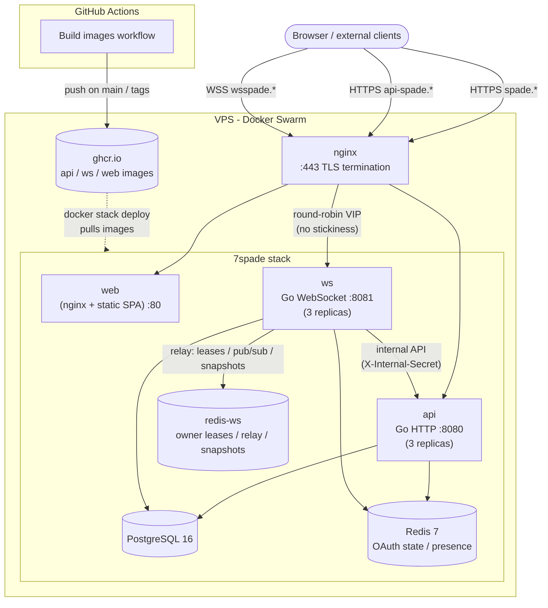

# Deployment

Seven Spade deploys to a single VPS with Docker Swarm (`docker stack deploy`) behind nginx with TLS. Images are built by GitHub Actions and published to GitHub Container Registry; the server only pulls and runs those images.

The deploy configuration lives outside the docs and is the source of truth:

- [`deployment/stack.yml`](../../deployment/stack.yml) - Docker Swarm stack
- [`deployment/nginx/7spade.conf`](../../deployment/nginx/7spade.conf) - nginx reverse proxy config

## Current Production Shape

The current stack runs:

| Service | Replicas | Purpose |
|---|---:|---|
| `postgres` | 1 | PostgreSQL 16 data store |
| `redis` | 1 | OAuth state, presence, room snapshots |
| `redis-ws` | 1 | WebSocket owner leases, pub/sub relay, snapshots |
| `api` | 3 | Go HTTP API |
| `ws` | 3 | Go WebSocket server |
| `web` | 1 | nginx-served React SPA |

Swarm ignores `depends_on`; the entries in `deployment/stack.yml` are useful for readability and Compose compatibility, but startup correctness depends on health checks and application retry/fail-fast behavior.

## Start Here

1. Read [Prerequisites](./prerequisites.md).
2. Prepare [Environment](./environment.md).
3. Deploy the [Swarm stack](./swarm.md).
4. Configure [Reverse proxy and TLS](./reverse-proxy.md).
5. Use [Operations](./operations.md) for health checks, logs, and upgrades.
6. Use [Database Backups](./database-backups.md) for PostgreSQL backup and restore.

## Reference

| Document | Purpose |
|---|---|
| [Prerequisites](./prerequisites.md) | VPS, DNS, Docker, and Swarm requirements |
| [Environment](./environment.md) | Runtime env files and build-time client variables |
| [Swarm](./swarm.md) | Stack deployment using `deployment/stack.yml` |
| [Reverse Proxy](./reverse-proxy.md) | nginx and Certbot setup using `deployment/nginx/7spade.conf` |
| [Operations](./operations.md) | Health checks, backups, monitoring, upgrades |
| [Database Backups](./database-backups.md) | PostgreSQL backup, restore, and S3-compatible off-server storage |
| [CI/CD](./ci-cd.md) | GitHub Actions image builds and optional deploy automation |
| [Scaling](./scaling.md) | Capacity notes and multi-replica WebSocket model |
| [Troubleshooting](./troubleshooting.md) | Common production failures and fixes |

## Production Topology

Production subdomains currently use the `fahrur.my.id` domain. Generic examples in the docs use `example.com`; replace them with the real production hostnames when deploying.
