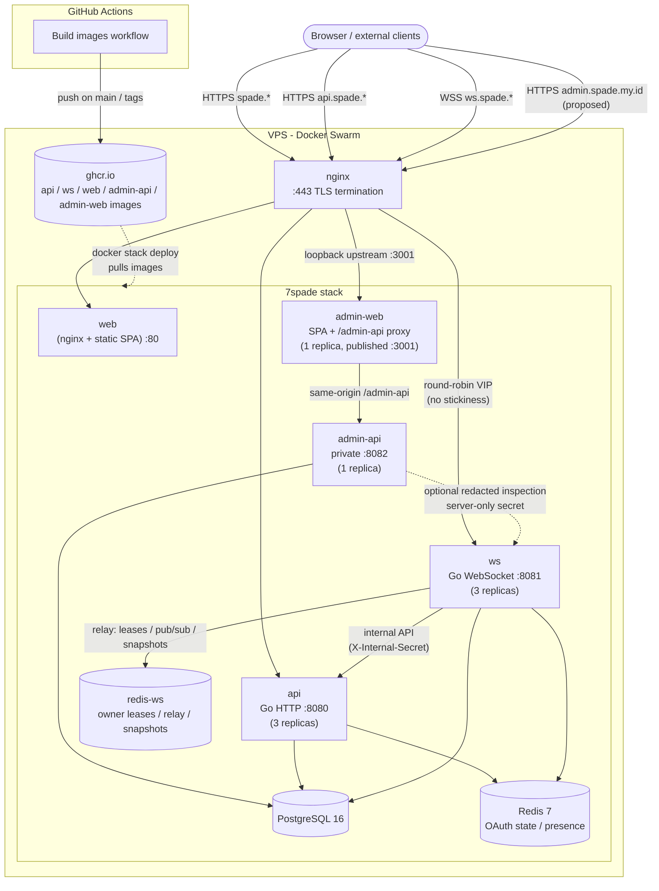

# Deployment

Seven Spade deploys to a single VPS with Docker Swarm (`docker stack deploy`) behind nginx with TLS. Images are built by GitHub Actions and published to GitHub Container Registry; the server only pulls and runs those images.

The agreed production target includes the player and admin applications. Follow
[Admin Deployment](./admin.md) for the infrastructure contract, manual first
provisioning, and security checks before enabling release auto-updates. These
docs do not assert that the target has already been deployed; verify that the
selected release includes the required stack, image, and proxy changes.

The deploy configuration lives outside the docs and is the source of truth:

- [`deployment/stack.yml`](../../deployment/stack.yml) - Docker Swarm stack
- [`deployment/nginx/7spade.conf`](../../deployment/nginx/7spade.conf) - nginx reverse proxy config

## Agreed Production Shape

The target stack runs:

| Service | Replicas | Purpose |
|---|---:|---|
| `postgres` | 1 | PostgreSQL 16 data store |
| `redis` | 1 | OAuth state, presence, room snapshots |
| `redis-ws` | 1 | WebSocket owner leases, pub/sub relay, snapshots |
| `api` | 3 | Go HTTP API |
| `ws` | 3 | Go WebSocket server |
| `web` | 1 | nginx-served React SPA |
| `admin-api` | 1 | Separate admin control plane; internal `8082`, no published port |
| `admin-web` | 1 | Admin SPA and same-origin `/admin-api` proxy; published `3001:80` |

Swarm ignores `depends_on`. The player API must finish shared-schema migrations
before admin startup/bootstrap; verify the migration ledger and authenticated
reads, not just task convergence or the admin liveness endpoint. All five
application images use `${IMAGE_TAG:-latest}` in the agreed stack.

## Start Here

1. Read [Prerequisites](./prerequisites.md).
2. Prepare [Environment](./environment.md).
3. Deploy the [Swarm stack](./swarm.md).
4. Configure [Reverse proxy and TLS](./reverse-proxy.md).
5. Complete [Admin Deployment](./admin.md), including bootstrap and MFA, before release auto-updates.
6. Use [Operations](./operations.md) for health checks, logs, and upgrades.
7. Use [Database Backups](./database-backups.md) for PostgreSQL backup and restore.

## Reference

| Document | Purpose |
|---|---|
| [Prerequisites](./prerequisites.md) | VPS, DNS, Docker, and Swarm requirements |
| [Environment](./environment.md) | Runtime env files and build-time client variables |
| [Swarm](./swarm.md) | Stack deployment using `deployment/stack.yml` |
| [Admin Deployment](./admin.md) | Five-service contract, env tables, first provisioning, bootstrap, smoke tests, and recovery |
| [Reverse Proxy](./reverse-proxy.md) | nginx and Certbot setup using `deployment/nginx/7spade.conf` |
| [Operations](./operations.md) | Health checks, backups, monitoring, upgrades |
| [Database Backups](./database-backups.md) | PostgreSQL backup, restore, and S3-compatible off-server storage |
| [CI/CD](./ci-cd.md) | GitHub Actions image builds and optional deploy automation |
| [Scaling](./scaling.md) | Capacity notes and multi-replica WebSocket model |
| [Troubleshooting](./troubleshooting.md) | Common production failures and fixes |

## Production Topology

```mermaid
flowchart TB
    subgraph CI["GitHub Actions"]
        build["Build images workflow"]
    end
    ghcr[("ghcr.io<br/>api / ws / web / admin-api / admin-web images")]
    build -- "push on main / tags" --> ghcr

    browser(["Browser / external clients"])

    subgraph vps["VPS - Docker Swarm"]
        nginx["nginx<br/>:443 TLS termination"]

        subgraph stack["7spade stack"]
            web["web<br/>(nginx + static SPA) :80"]
            api["api<br/>Go HTTP :8080<br/>(3 replicas)"]
            ws["ws<br/>Go WebSocket :8081<br/>(3 replicas)"]
            adminweb["admin-web<br/>SPA + /admin-api proxy<br/>(1 replica, published :3001)"]
            adminapi["admin-api<br/>private :8082<br/>(1 replica)"]
            pg[("PostgreSQL 16")]
            redis[("Redis 7<br/>OAuth state / presence")]
            redisws[("redis-ws<br/>owner leases / relay / snapshots")]
        end

        ghcr -. "docker stack deploy<br/>pulls images" .-> stack
    end

    browser -- "HTTPS spade.*" --> nginx
    browser -- "HTTPS api.spade.*" --> nginx
    browser -- "WSS ws.spade.*" --> nginx
    browser -- "HTTPS admin.spade.my.id (proposed)" --> nginx

    nginx --> web
    nginx --> api
    nginx -- "round-robin VIP<br/>(no stickiness)" --> ws
    nginx -- "loopback upstream :3001" --> adminweb
    adminweb -- "same-origin /admin-api" --> adminapi
    adminapi --> pg
    adminapi -. "optional redacted inspection<br/>server-only secret" .-> ws

    api --> pg
    api --> redis
    ws --> pg
    ws --> redis
    ws -- "relay: leases / pub/sub / snapshots" --> redisws
    ws -- "internal API<br/>(X-Internal-Secret)" --> api
```

Production subdomains currently use the `my.id` domain. Generic examples in the docs use `example.com`; replace them with the real production hostnames when deploying.
