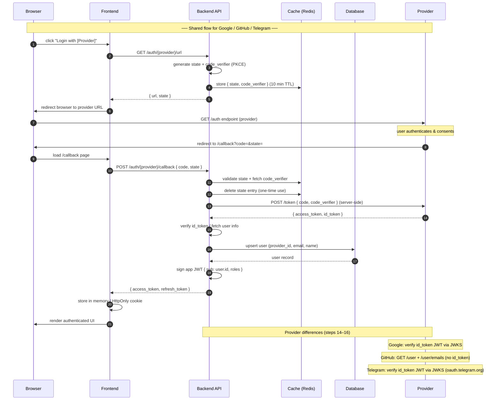

# Auth architecture — multi-provider OAuth / OIDC

## Sequence diagram



---

## Provider comparison

| Property              | Google                            | GitHub                                 | Telegram                                  |
|-----------------------|-----------------------------------|----------------------------------------|-------------------------------------------|
| Protocol              | OAuth 2.0 + OIDC                  | OAuth 2.0 only                         | OIDC (Authorization Code + PKCE)          |
| Discovery document    | `accounts.google.com/.well-known` | ❌ none                                | `oauth.telegram.org/.well-known/openid-configuration` |
| Authorization URL     | `accounts.google.com/o/oauth2/v2/auth` | `github.com/login/oauth/authorize` | `oauth.telegram.org/auth`                 |
| Token URL             | `oauth2.googleapis.com/token`     | `github.com/login/oauth/access_token`  | `oauth.telegram.org/token`                |
| JWKS URL              | `googleapis.com/oauth2/v3/certs`  | ❌ none                                | `oauth.telegram.org/.well-known/jwks.json` |
| Returns `id_token`    | ✅ yes                            | ❌ no                                  | ✅ yes                                    |
| PKCE support          | ✅ recommended                    | ✅ recommended                         | ✅ recommended (S256)                     |
| `client_secret`       | Required                          | Required                               | Required (from @BotFather)                |
| User identity field   | `sub` (Google account ID)         | `id` (numeric GitHub user ID)          | `sub` (Telegram user ID)                  |
| Email availability    | ✅ in `id_token`                  | Separate `GET /user/emails` call       | ❌ not provided                           |
| Setup                 | Google Cloud Console              | GitHub → Settings → OAuth Apps         | @BotFather → Bot Settings → Web Login     |
| `client_id` format    | `*.apps.googleusercontent.com`    | Short alphanumeric string              | Numeric Bot ID                            |

---

## Backend endpoints

| Method | Path                          | Description                                      |
|--------|-------------------------------|--------------------------------------------------|
| GET    | `/auth/{provider}/url`        | Generate auth URL + state; store in Redis        |
| POST   | `/auth/{provider}/callback`   | Validate state, exchange code, return app JWT    |
| POST   | `/auth/refresh`               | Rotate app refresh token                         |
| DELETE | `/auth/logout`                | Revoke refresh token                             |

`{provider}` = `google` | `github` | `telegram`

---

## Provider-specific notes

### Google
- Verify `id_token` using JWKS from `https://www.googleapis.com/oauth2/v3/certs`
- Check `iss` = `https://accounts.google.com`, `aud` = your client ID, `exp` not expired
- Scopes: `openid email profile`

### GitHub
- GitHub does **not** issue an `id_token` — it is OAuth 2.0 only, not OIDC
- After token exchange, call `GET https://api.github.com/user` for profile
- Call `GET https://api.github.com/user/emails` separately to get the primary verified email
- Use the numeric `id` field as the stable identity key (not the username — it can change)

### Telegram
- Full OIDC: verify `id_token` JWT using JWKS from `https://oauth.telegram.org/.well-known/jwks.json`
- Check `iss` = `https://oauth.telegram.org`, `aud` = your Bot ID (numeric), `exp` not expired
- Telegram does **not** provide a `userinfo` endpoint — all claims are in the `id_token` directly
- Scopes: `openid profile` (optionally `phone`, `telegram:bot_access`)
- `client_id` and `client_secret` come from **@BotFather → Bot Settings → Web Login**
- Register every redirect URI in @BotFather before use

---

## Token storage

| Token               | Storage                  | Why                                      |
|---------------------|--------------------------|------------------------------------------|
| App access token    | In-memory / React state  | Short-lived, no persistence needed       |
| App refresh token   | `HttpOnly` cookie        | XSS-safe, survives page refresh          |
| Provider tokens     | Server only (never sent) | Scoped to provider APIs, not your app    |

---

## Database schema (providers table)

```sql
CREATE TABLE user_providers (
  id          UUID PRIMARY KEY DEFAULT gen_random_uuid(),
  user_id     UUID NOT NULL REFERENCES users(id),
  provider    TEXT NOT NULL,          -- 'google' | 'github' | 'telegram'
  provider_id TEXT NOT NULL,          -- sub / github id / telegram sub
  email       TEXT,                   -- null for Telegram (not provided)
  created_at  TIMESTAMPTZ DEFAULT now(),
  UNIQUE (provider, provider_id)
);
```

---

The key differences worth calling out:

GitHub is the odd one out — it's plain OAuth 2.0, not OIDC, so there's no `id_token` and no JWKS. You have to make two extra API calls after the token exchange (`/user` and `/user/emails`) and use the numeric `id` as the stable identity key.

Telegram's OIDC is very clean — it follows Authorization Code + PKCE, has a discovery document, and puts all claims directly in the `id_token` (no separate userinfo endpoint). The only quirk is that setup goes through @BotFather, not a developer console.

Google is the reference implementation — full OIDC, JWKS-verifiable `id_token`, email in the token, nothing extra needed.